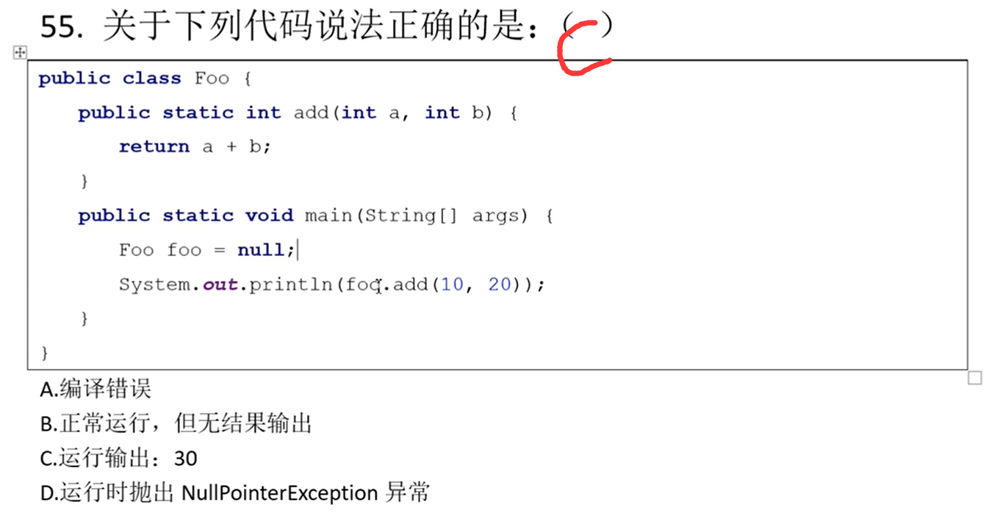

# Java笔试面试集合

*前言: 前几天一家公司要先笔试后面试, 笔试都没过, 太坑了, 好多都是一眼看过去非常熟悉但是就是不确定哪些是100%正确的, 所以刷题是非常有必要的*

> 作者: LaoPeng
>
> 2024/8/6 16:37 始

### 1.哪些是合法的变量名
<span style="color: red">硬要说的话G也可以编译通过, 因为甚至连中文汉字都能作为变量名何况中文的$符号￥</span>为什么在我的印象中是不能使用数字和下划线开头啊(实际下划线是可以的)<br/>


### 2.类名和java文件名是什么关系
```
1. Java的源文件扩展名为.java
2. 如果一个类中的类名字前面没有public 的情况下，类名和文件名没有任何约束
3. 一个java文件中可以有多个类
4. 如果一个类前面有public来修饰，那么这个类必须和文件名字一致
5. 一个类中只能有一个public类，其余的类都不能有public
```


### 3.基本数据类型表述大小
<span style="color: red">下表中从 byte => double 表述范围大小依次递增  为什么long8个字节没有float4个字节表示范围大？是因为底层的存储方式决定的,float的科学计数法</span><br/>
```
byte，short，int，long，float，double，boolean，char
1   ，2    ，4  ，8   ，4    ，8     ，1      ，2   
```


### 4.循环结构合法的是
<span style="color: red">A错 while()条件中可以赋值, 但不能定义变量, 且结果需要是可以boolean值</span><br/>
<span style="color: red">B错 while()条件的结果需要是一个boolean值, int不行</span><br/>
<span style="color: red">D错 请看下段代码 loop标记为需要定义, 选项中并没有定义. break和continue的作用分别为跳出当前循环和跳出当前本次循环, loop可以使其跳出指定(外层)的循环</span><br/>
```java
public class Test {
    public static void main(String[] args) {

        loop:
        while(true) {
            while(true) {
                break loop;
            }
        }

        System.out.println("aa");
    }
}
```


### 5.三目运算符
<span style="color: red">表面上选B, 但实际上选C, 数值类型变量在做运算的时候，会自动把低精度的数值往高精度的数值类型转换。小数默认为double类型。</span><br/>


### 6.局部变量初始化
<span style="color: red">表面上选B, 实际上选D</span><br/>
<span style="color: red">局部变量不会有默认值, 一定要先进行初始化后再使用</span><br/>
<span style="color: red">全局变量(类变量) 会在类初始化时, 由JVM自动赋值默认值</span><br/>
```java
public class Test {
    int cc;
    public static void main(String[] args) {
        Test test = new Test();
        System.out.println(test.cc);
        System.out.println(test.cc++);
        System.out.println(test.cc);
        
        int c;
        System.out.println(c);// idae提示报错: Variable 'c' might not have been initialized, 编译报错 java: 可能尚未初始化变量c
        System.out.println(c++);
        System.out.println(c);

        int x;
        boolean flag = true;
        if (flag) {
            x = 10; // 在分支中初始化
        }
        System.out.println(x);// 此处x一样会编译报错提示初始化x, 除非直接if(true)
    }
}
```


### 7.多变量定义和前加加
<span style="color: red">表面上选D, 实际上就是选D</span><br/>


### 8.主方法main竟然还可以这么写
<span style="color: red">表面上选AD, 实际上就是AD, 主方法的 public static void main是不能变的, 参数字符串数组也不能变, 变量名可以变</span><br/>


### 9.for死循环
<span style="color: red">没有套路, 就是选C</span><br/>


### 10.char+int
<span style="color: red">我以为选B, 但实际选D, 因为字符类型的5+2, 肯定不能选C, '5'的ASCII码不可能是0, 其余的我不知道'5'的ASCII码是多少我也拿不准, 解释是只有字符串的"5"+2才是A, 数值型的5+2才是B, 所以都排除, 只能选D</span><br/>
<span style="color: red">但实际考察的是 字符类型与int类型相加, 是以ASCII码的形式相加的, 并且这样相加打印结果为int型或者说数值型, 如想打印7, 需要强转`System.out.println((char)('5' + 2));`</span><br/>


### 11.表达式
<span style="color: red"></span>BCD, 无套路, 可能需要注意的就是 byte 一个字节是 -128 ~ 127, 所以A是越界的, B是包装类是可以赋值为null的, C是没有越界的16进制可以赋值给long和int都可以,short应该也可以, byte需要强转才可以<br/>


### 12.表达式2
<span style="color: red">表面上看都会出现错误, 但是实际上选A, 从3.基本数据类型可以看到, float是大于long的, 所以小类型是会向大类型自动转换的, D中的10.0要赋值给int需要强转, 因为是大类型向小类型转换, 会丢失精度</span><br/>


### 13.switch与类型转换
<span style="color: red">进过前面几题我知道了选B, 因为返回值result是long类型的, long类型比方法要求的返回值int范围大, 大类型向小类型转换是会丢失精度的, 所以不会自动转换, 需要强转</span><br/>
<span style="color: red">之前我可能会选D, 因为如果不是强转, 正常switch没有break的情况下, 正常执行结果就是10, 由于运算符的优先级 result + i * 2是会先执行 i*2 之后在 result + 这点需要注意(Java运算符优先级)</span><br/>


### 14.后加加前减减
<span style="color: red">选B没毛病, ++, --的运算符优先级是很高的, i++ * 2 == 2 同时1=2, 3 * --i = 3 同时 i=1, 2+3=5, 我觉得比较可能失误的就是i++它是什么时候生效, 当i++参与某一次运算后i就+1了, 比如 i++ * 2 执行完后i就+1了, 所以后面的 --i时, 就已经是--2了 </span><br/>


### 15.赋值与加加减减
<span style="color: red">表面上看, 是num先赋值给num然后再++所以是后++的值覆盖了之前赋值的值, 循环100次就是100, 但是实际上由于JVM的复杂关系, num++在此时并不会生效, **所以记住 i = i++是无效的**</span><br/>
```java
public class Test {
    public static void main(String[] args) {
        int num = 100;
        num = num++ + 1;// 可以看到 num++并没有生效
        System.out.println(num);// 101
    }
}
```


### 16.短路与短路或
<span style="color: red"></span>表面上选D, 实际就是选D, && 和 || 都是短路的, 即&& 前面的条件已经认定为假了, 那么后面的条件根本不会执行, || 也一样, || 前面的条件已经为真了, 那么后面的条件就不会执行, 因为一直满足条件了<br/>


### 17.值传递
<span style="color: red">值传递, 一眼B</span><br/>
<span style="color: red">基本数据类型是值传递, 引用类型(对象)是引用传递(址传递)</span><br/>
```java
public class Test {
    public static void main(String[] args) {
        ArrayList<String> list = new ArrayList<>();
        list.add("A");
        list.add("B");
        list.add("C");
        method(list);

        System.out.println(list);// [A, B, C, D, E, F]

        int i = 10;
        method2(i);
        System.out.println(i);// 10
    }

    public static void method(List<String> list) {
        // 此处add DEF, 很显然是会对外面的list生效的, 因为此处的list就是外部的list(引用传递)
        list.add("D");
        list.add("E");
        list.add("F");

        // 此出给list赋值为 1,2,3的集合, 是不会生效的, 因为 之前参数中的list是指向外部的list,
        // 而此时你将一个新的局部变量集合123赋值给了参数list, 那么这个list就指向了该123, 那么你修改123和我外部的ABC有什么关系?
        list = new ArrayList<String>(Arrays.asList("1", "2", "3"));
    }

    public static void method2(int i) {
        i = i + 10;
    }
}
```


### 18.基本数据类型
<span style="color: red">一眼B, int类型的5与魔除int类型的2, == 1, int类型的5除int类型的2约等于int类型的2</span><br/>
<span style="color: red">假如 a 是float类型, 那么之前讲的不同类型在进行运算时小类型会向大类型自动转换, 5.0 % 2 结果实际上是 1.0f, 1.0f == 1 是为true的, 5.0f / 2 结果也是浮点数 2.5f</span><br/>


### 19.局部变量作用域
<span style="color: red">一眼A, for里面定义的i只能在for里面使用</span><br/>


### 20.短路运算符
<span style="color: red">一眼BD</span><br/>


### 21.表达式编译报错
<span style="color: red">一眼ABCD, A没毛病, B涉及到浮点数(大类型)向int(小类型)赋值, 会丢失精度, 需要强转, C float(小类型)向double(大类型)赋值, 会自动转换, D 字符型被赋值为整数, 这个也是可以的相当于赋值的是ASCII码</span><br/>


### 22.判断中赋值
<span style="color: red">一眼C</span><br/>


### 23.基本数据类型自动转换
<span style="color: red">一眼AD, 之前说过了低类型会向高类型自动转换, 高类型赋值给低类型需要强转, A需要一个float返回值, 直接return;是不行的, D需要float却返回double是需要强转的</span><br/>


### 24.构造方法没有返回值也不需要void
<span style="color: red">表面上选AD, 但实际选CD</span><br/>
<span style="color: red">A 我认为方法是个空实现即{}就是没有方法体的, 但是实际方法出现{}就已经是有实现了, 接口或抽象类中的方法根本没有{}</span><br/>
<span style="color: red">B 参数传递确实是值传递, 引用(址)传递相当于也是值传递, 变量存储的是引用地址, 将引用地址赋值给了方法参数, 也是一种值传递</span><br/>
<span style="color: red">C 构造方法就没有返回值, 也没有声明返回为 void</span><br/>
<span style="color: red">D 方法定义没有返回值即 void, 可以出现return; 来提前结束该方法</span><br/>


### 25.按位与
<span style="color: red">一眼C</span><br/>


### 26.数组下标越界
<span style="color: red">一眼B, 下标越界</span><br/>


### 27.数组定义方式
<span style="color: red">一眼D, 不能在指定数组长度时, 同时指定数组内容</span><br/>


### 28.方法重载
<span style="color: red">一眼D, 重载条件: 参数类型不同, 参数数量不同, 参数顺序不同. (返回值类型不同不可以, 参数名称不同不可以, 与方法修饰符无关)</span><br/>
<span style="color: red">C也是错的, 虽然方法返回类型与不构成重载的条件, 但是当方法已经构成重载即方法参数不一致或类型不一致或顺序不一致时, 方法返回值是可以修改的</span><br/>


### 29.方法重载
<span style="color: red">一眼AC, A方法参数类型不同, C方法参数数量不同, 均构成重载</span><br/>
<span style="color: red">B只有返回值不同, 返回值与构不构成重载无关, D方法参数名不一致不构成重载</span><br/>


### 30.构造方法
<span style="color: red">AB, A构造方法确实不能继承, 如果可以继承则可以随意调用了, 但实际只能在子类构造中通过super()调用且只能在第一行, B都不能被继承还怎么重写</span><br/>
<span style="color: red">C构造方法是可以被重载的, D构造方法可以声明为private, 单例就是</span><br/>


### 31.类的说法
<span style="color: red">一眼D</span><br/>


### 32.自动导入包
<span style="color: red">一眼B, A需要导入参考: java.util.Random, java.util.List使用前需要 import, B自动导入参考: java.lang.String使用前并没有import, C没见过的包, D io包就是要导入参考输入输出流</span><br/>


### 33.构造方法
<span style="color: red">一眼BC, 修饰符的可以变的. AD不对构造方法哪有返回值</span><br/>


### 34.抽象类
<span style="color: red">一眼B</span><br/>


### 35.接口
<span style="color: red">A还可以有default默认实现的方法, 和static静态方法</span><br/>
<span style="color: red">B接口默认就是public的, 也不能用private等修饰符修饰, 貌似jdk1.9之后可以用private修饰了</span><br/>
<span style="color: red">D接口中可以定义常量, 常量和类的属性是不一样的</span><br/>


### 36.修饰符修饰类
<span style="color: red">D和E只能在内部类上修饰</span><br/>


### 37.实现两个接口
<span style="color: red">一眼C</span><br/>


### 38.继承.png
<span style="color: red">表面上选AD, 实际上选CD, A错, 类只允许单一继承, 接口是可以多继承的</span><br/>


### 39.this
<span style="color: red">一眼C, 和构造方法,getter,setter方法中的this一样的</span><br/>


### 40.super
<span style="color: red">一眼C, super是调用父类构造器的，而且必须要出现在子类构造器的第一行。super省略会默认调用父类的默认构造器。如果父类中的构造器存在重载，在子类中需要显式的调用有参构造器或在父类中显式的声明无参构造器。</span><br/>


### 41.构造方法
<span style="color: red">一眼D, 构造方法可以重载, 不存在说只能定义多少个</span><br/>


### 42.实例方法类方法
<span style="color: red">A错, 实例方法中可以访问实例变量也可以访问类(静态)变量</span><br/>
<span style="color: red">B错, 类方法只能访问类变量, 无法访问实例变量</span><br/>
<span style="color: red">C错, 类方法虽然正常是通过类名来调用, 但是非要用实例对象来调用也不会报错</span><br/>
<span style="color: red">D是对的</span><br/>
<span style="color: red">类方法也就是静态变量静态方法, 是在类初始化时候就加载了的, 所以是先于实例对象的, 那么类方法显然是不可以访问实例对象或实例方法的(毕竟有类方法时都没有实例对象), 反之实例方法是可以调用类方法或类变量的(因为有实例对象时, 类方法已经产生了)</span><br/>


### 43.接口的定义与实现
<span style="color: red">一眼D, A错之前说了, 接口中的static方法和default都是有实现的, B接口中只能定义常量, 如果定义 int i = 10; 实际上jvm是会自动加上 public static final， C错, 多个实现类可以有不同的实现方式, 没有必要使用相同的代码</span><br/>


### 44.抽象类
<span style="color: red">C, A错, 子抽象类可以不必将父抽象类的抽象方法全部实现, B错接口是接口, 抽象类是抽象类, 抽象类除了有抽象方法外和普通的类没有太大区别, D错抽象类中也可以有正常的方法</span><br/>
<span style="color: red">C我之前认为直接 new 抽象类然后实现抽象类内部的抽象类的方法也算是一种用抽象类创建对象的方式, 但其实不算, 这种是匿名内部类的方式, 相当于有一个匿名的类继承该抽象类并实现抽象方法, 所以不算抽象类创建的对象而是这个匿名的类</span><br/>


### 45.final关键字
<span style="color: red">C, final成员变量必须初始化(直接初始化和在构造器中初始化)，初始化后不能再更改，因此，如果声明之后没有赋值，仅可在构造器中对其初始化。</span><br/>
<span style="color: red">final可以修饰类和属性和方法，都表示不可再修改。final类不可继承，属性不可更改值，方法不可重写。</span><br/>


### 46.接口抽象类
<span style="color: red">AD, A抽象类中是可以什么都没有的, D之前说过接口中可以有static方法和default方法(1.8及以后)</span><br/>


### 47.接口定义常量
<span style="color: red">ABCD, 以下方式都是可以的, public static final 这三关键字, 在接口中定义变量(常量)时, 写或不写其中某一个或全部, 都是可以的, 都是默认public static final. 如果你不指明int这种类或者不给常量初始化赋值才会报错</span><br/>
<span style="color: red"></span><br/>


### 48.构造方法
<span style="color: red">一眼D, A错, 类拥有默认的构造方法(这并不需要显示定义), B错, 构造方法没有返回值, C构造方法可以重载, 所以必须可以携带参数</span><br/>


### 49.构造方法
<span style="color: red">一眼C, 因为那不是一个构造方法, 那只是一个普通的名字和类名一样的, 返回值为void的实例方法</span><br/>


### 50.构造方法


### 51.private和重载
<span style="color: red">D, i在父类中定义为private, 子类不能访问, 通过super.i也不行, super是区分子类和父类同名的实例变量</span><br/>
<span style="color: red">public ：公共权限，可以被任意类访问，不同包不同类依然可以访问</span><br/>
<span style="color: red">protected：受保护的权限，可以被同包类访问，如果不是同包类，必须是该类的子类才可以访问</span><br/>
<span style="color: red">default：默认的(无)，同包权限，只能被同包的类访问</span><br/>
<span style="color: red">private：私有权限，只能在本类中访问，同包其他类也不能访问</span><br/>


### 52.构造方法
<span style="color: red">一眼B, 子类构造方法如果不显式调用父类的某一个指定构造方法, 是会默认自动隐式调用父类无参构造即super(), Parent2并没有显式调用, 说明会走默认调用Parent1(), 但Parent1定义了一个参数的构造器, 默认的隐式无参构造就没有了, 所以报错</span><br/>


### 53.构造方法
<span style="color: red">一眼C, A错众所周知没有东西会受参数名称的影响, B错super是用来区分子父类相同名称的属性的, 此处只有一个name, 用不用都可, C对 super是调用父类构造器的，而且必须要出现在子类构造器的第一行</span><br/>


### 54.父子类继承构造方法
<span style="color: red">一眼C, new的Three(), Three()中会有super() -> Two()中会有super() -> One(), 先调用Two才能有Three, 现有了One才能有Two, 所以是123 </span><br/>


### 55.实例对象访问静态方法
<span style="color: red">考察类方法和对象方法的堆栈结构。IDE会提示：不应该通过类实例访问静态成员，但是能正常运行。</span><br/>
<span style="color: red">对于null的对象变量，访问对象变量和对象方法时，由于会依赖具体对象，因此都会出现空指针异常。访问类变量和类方法时，由于不依赖对象，因此调用是没有问题的。堆栈结构查阅jvm相关知识。</span><br/>


### 56.多态父子类
<span style="color: red">A对, 子类实现赋值给父类引用</span><br/>
<span style="color: red">B错, ClassB和ClassC虽然都是ClassA的子类但是并没有实际关系, 不能相互赋值</span><br/>
<span style="color: red">C错, ClassA类型的p4(虽然实际是ClassC)赋值ClassC类型的, 父类转为子类需要强转</span><br/>
<span style="color: red">D错, 和B选项一样, 两个子类不能互相转换</span><br/>
```java
ClassA p5 = new ClassB();
ClassC p6 = new ClassC();
p6 = (ClassC)p5;
// 编译器不报错, 但是运行期会报错, 不能转换
// 因为p5虽然是父类的引用, 但是是子类的实例, 因此p5和p6之间(实际并没有关系)是依然存在子类之间的转换。
```


### 57.多态题下面程序运行结果是什么
<span style="color: red">一眼D, animal虽然是Animal类型(父类)的, 但是实际是Dog类型(子类)的实例, 现在却要强转给Cat(另一个子类)表面上父类强转子类没问题, 所以编译阶段不会报错, 但是实际上animal并不是父类而且Dog所以运行时报错 </span><br/>
```java
public class Animal {
    public String noise() {
        return "peep";
    }

    public static void main(String[] args) {
        Animal animal = new Dog();
        Cat cat = (Cat) animal;
        System.out.println(cat.noise());
    }
}

class Dog extends Animal {
    public String noise() {
        return "bark";
    }
}

class Cat extends Animal {
    public String noise() {
        return "meow";
    }
}
/**
 * A.peep
 * B.bark
 * C.meow
 * D.抛出运行时异常
 */
```

### 58.子类重写方法程序运行结果是什么
<span style="color: red">一眼A</span><br/>
```java
class SimpleCalc {
    public int value;

    public void calculate() {
        value += 7;
    }
}


public class MultiCalc extends SimpleCalc {

    public void calculate() {
        value -= 3;
    }

    public void calculate(int multiplier) {
        calculate();// value = 0 - 3
        super.calculate();// value = -3 + 7
        value *= multiplier;// value = 4 * 2
    }

    public static void main(String[] args) {

        MultiCalc calculator = new MultiCalc();
        calculator.calculate(2);
        System.out.println("Value is: " + calculator.value);
    }
}
/**
 * A.Value is: 8
 * B.Value is: -8
 * C.Value is: 12
 * D.Value is: -12
 */
```

### 59.下面哪种是多态形式的方法调用
<span style="color: red">我以为ABC, 实际AB</span><br/>
<span style="color: red">多态调用指的是父类通过自身调用子类重写后的方法</span><br/>
<span style="color: red">A表面上是调用A的a2()方法, 实际上是类B的a2()方法, 所以是多态</span><br/>
<span style="color: red">B表面上是调用A的a2()方法, 实际上是调用的类C继承至类B的a2()方法, 所以是多态</span><br/>
<span style="color: red">C编译错误, A中并没有c1()方法, Cannot resolve method 'c1' in 'A'</span><br/>
<span style="color: red">D引用y类,实现y类, 和多态没有关系</span><br/>
```java
public abstract class A {
    abstract void a1();

    void a2() {
    }
}

class B extends A {
    void a1() {
    }

    void a2() {
    }
}

class C extends B {
    void c1() {
    }
}

/**
 * 和
 * A x = new B();
 * C y = new C();
 * A z = new C();
 */

/**
 * A.x.a2();
 * B.z.a2();
 * C.z.c1();
 * D.y.c1();
 */
```

### 60.程序执行的结果是
<span style="color: red">我觉得A, 也有可能C, 实际就是A (因为毕竟是父类引用, 指向的属性应该是父类的属性)</span><br/>
<span style="color: red">一句话, 属性没有多态, 在子类初始化之前, 父类也初始化了(默认调用super()所以父类 a = 3), foo.addFive()是多态调用增加的是子类a的值</span><br/>
````java
class Foo {
    public int a;

    public Foo() {
        a = 3;
    }

    public void addFive() {
        a += 5;
    }
}

class Bar extends Foo {

    public int a;

    public Bar() {
        a = 8;
    }

    public void addFive() {
        this.a += 5;
    }
}

public class Test {
    public static void main(String[] args) {
        Foo foo = new Bar();
        foo.addFive();
        System.out.println("Value: " + foo.a);
    }
}

/**
 * A.Value: 3
 * B.Value: 8
 * C.Value: 13
 * D.Value: 18
 */
````

### 61.关于构造器调用下面说法正确的是哪个
<span style="color: red">A, 考察继承关系中构造器的调用链</span><br/>
<span style="color: red">this和super调用构造器的时候均需要在第一行, 不能同时使用, 需要保证构造子类对象时最终调用的构造器能够显式或隐式的调用父类构造器.</span><br/>
<span style="color: red">this用于调用本类中的其他构造器, 使用this后不再调用父类的构造器而是传递给最终调用的构造器调用. super用于调用父类的构造器.</span><br/>
<span style="color: red">子类构造器中如果显式的调用了父类的有参构造, 则父类的默认构造将不再调用. 如果没有显式调用, 则会在调用的**最终构造器**中隐式调用父类的默认构造器。</span><br/>
```java
public class Test {

    public static void main(String[] args) {
        Child c = new Child();
    }
}

class Father {
    public Father() {
        System.out.println("父类无参构造函数");
    }

    public Father(String name) {
        System.out.println("父类有参构造函数");
    }
}

class Child extends Father {
    public Child() {
        this("dd");// this和super调用构造器的时候均需要在第一行, 不能同时使用, 需要保证构造子类对象时最终调用的构造器能够显式或隐式的调用父类构造器.
        System.out.println("子类无参构造函数");
    }

    public Child(String name) {
        super("dd");
        System.out.println("子类有参构造函数");
    }
}
/**
 * A.父类有参构造函数 子类有参构造函数 子类无参构造函数
 * B.父类无参构造函数 子类有参构造函数 子类无参构造函数
 * C.子类有参构造函数 子类无参构造函数 父类无参构造函数
 * D.子类无参构造函数 子类有参构造函数 父类无参构造函数
 */
```

### 62.如何判断父类的真身是什么
<span style="color: red">D</span><br/>
<span style="color: red">instanceof用于判断实例具体类型, 解决子类强转引发的运行时异常. 判断instanceof左边的对象是否是右边类的实例</span><br/>
```java
public class Animal {
    public String noise() {
        return "peep";
    }

    public static void main(String[] args) {
        Cat cat = null;
        Animal animal = new Dog();
        if (animal instanceof Cat) {// false
            cat = (Cat) animal;// 会抛出异常 Dog类怎么能强转为 Cat类呢
            System.out.println(cat.noise());
        } else {
            System.out.println("animal is not Cat's instance");
        }
    }
}

class Dog extends Animal {
    public String noise() {
        return "bark";
    }
}

class Cat extends Animal {
    public String noise() {
        return "meow";
    }
}
/**
 * A.peep
 * B.bark
 * C.meow
 * D.animal is not Cat's instance
 */
```

### 63.下面代码输出什么
<span style="color: red">我以为是B, 实际就是B</span><br/>
<span style="color: red">重载方法参数中的多态. 子类可以向父类自动转换, 但父类只能强转到子类.</span><br/>
```java
class A{}
class B extends A{}

public class Test {
    public static void main(String[] args) {
        A b1 = new B();
        B b2 = new B();
        get(b1);// b1实际类型为A, 恰好也有 get(A a), 类型一致, 直接就调用了. 假如没有get(A a), 该方法也不会调用到get(B b)因为父类到子类需要强转
        get(b2);// b2实际类型为B, 恰好也有 get(B b), 类型一致, 直接就调用了, 假如没有get(B b), 该方法就会转为调用get(A a)因为B是A的子类, 子类到父类有自动转换
                // get(A a), get(B b)同时存在的情况下, get(b2)会直接调用get(B b)因为类型一致, 优先级高.
    }
    
    public static void get(A a) {
        System.out.println("A");
    }
    
    public static void get(B b) {
        System.out.println("B");
    }
}
/**
 * A.B  B
 * B.A  B
 * C.A  A
 * D.B  A
 */
```

### 64.方法重载坑爹题
<span style="color: red">应该不会选CD, 因为无论是String还是Object这两个参数都是可以为null的, 实际选A</span><br/>
<span style="color: red">重载方法参数中的多态. 重载方法中, 参数存在父子关系, 则传入的参数, 以匹配精度最高为准(子类优先级最高). null是引用数据类型的默认值. 如果不存在父子关系, 则传入null都匹配, 代码编译报错.</span><br/>
```java
public class Test {
    public void myMethod(String str) {
        System.out.println("string");
    }
    public void myMethod(Object obj) {
        System.out.println("Object");
    }
    public static void main(String[] args) {
        Test t = new Test();
        t.myMethod(null);
    }
}
/**
 * A.string
 * B.object
 * C.null
 * D.报错
 */
```

### 65.对象创建属性赋值流程
<span style="color: red">应该是C, 实际选D</span><br/>
<span style="color: red">我是这样想的, 首先初始化一个对象, 对象的属性肯定都是先赋值默认值, 我以为是 i =0; j = 0; 之后再给 i = qotJ() 所以最后是 i =10; j=10; 打印出来是 i=0; j=10; 实际我搞错了就是 int j = 0; 这一步根本不是jvm初始化对象给对象属性赋默认值, 而是我们手动赋值 j=0;</span><br/>
<span style="color: red">所以真正的指向顺序请看代码注释</span><br/>
```java
public class Demo1 {
    int i = qotJ();// 第二步给对象属性赋值, 结果为 j =10, 并打印i=0; i=j == 10
    int j = 0;// 第二步对象属性赋值, j = 0; (从 10 变为 0 了)

//    假设有构造器, 构造器就是用来给对象属性赋值的
//    public Demo1() {//第一步 new 出对象, 此处对象属性, 已经被赋值默认值了此处即 i=0; j=0;
//        System.out.println("执行构造器...");// 第三步执行构造器内部的逻辑, 即给对象属性赋值
//    }
    
    public int qotJ() {
        j = 10;
        System.out.println(i);
        return j;
    }
    
    public static void main(String[] args) {
        Demo1 demo1 = new Demo1();
        System.out.println(demo1.j);
    }
}
/**
 * A. 10  10
 * B. 10  0
 * C. 0   10
 * D. 0   0
 */
```

### 66.类属性的加载流程和单例的综合
<span style="color: red">我估计的流程是, 1.当类被调用静态属性或者静态方法时属于类的主动引用会触发类的初始化即给static变量分配地址并初始化默认值即 `singleton = null; counter1 = 0; counter2 = 0; ` 2.给static变量赋初始值`singleton = new Singleton();`此时counter1,2的值均为1, 然后counter1并没有赋值操作依旧是1, `counter2 = 0`所以最后结果 `counter1 = 1, counter2 = 0`</span><br/>
<span style="color: red">和上一题的实例变量顺序还是有一定差异的, static变量初始化是先于构造方法的</span><br/>
```java
public class Test {
    public static void main(String[] args) {
        Singleton s = Singleton.getSingleton();
        System.out.println("counter1 = " + s.counter1);
        System.out.println("counter2 = " + s.counter2);
    }
}

class Singleton {
    private static Singleton singleton = new Singleton();
    public static int counter1;
    public static int counter2 = 0;

    private Singleton() {
        counter1++;
        counter2++;
    }

    public static Singleton getSingleton() {
        return singleton;
    }
}
/**
 * A、程序将输出counter1 = 1 counter2 = 1
 * B、程序将输出counter1 = 1 counter2 = 0
 * C、程序将输出counter1 = 0 counter2 = 1
 * D、程序将输出counter1 = 0 counter2 = 0
 */
```

### 67.所有异常类都继承于哪个类
<span style="color: red">一眼B</span><br/>
```java
/**
 * A. java.io.Exception
 * B. java.lang.Throwable
 * C. java.lang.Exception
 * D. java.lang.Error
 */
```

### 68.关于异常下面说法正确的是
<span style="color: red">D</span><br/>
<span style="color: red">A，异常分为运行时异常和编译期异常。 B，程序只有运行到会产生异常的代码时，异常才会被创建。由jvm判断和创建异常对象。 C，异常的控制是为了增强程序的健壮性的，和运行速度无关。</span><br/>
```java
/**
 * A. 异常只有运行时才出现
 * B. 一旦程序运行, 异常将被创建, 并且由jvm自动创建
 * C. 为了保证程序运行速度, 要尽量避免异常控制
 * D. 以上说法都不对
 */
```

### 69.多个catch的排列方式是
<span style="color: red">B, 异常捕获也是从上到下的, 因此应该是精确度最高的在前面. 否则父类在前面抛一个异常最上面的父类全部都可以捕获那就没下面的子类啥事情了</span><br/>
```java
/**
 * A. 父类在先, 子类在后
 * B. 子类在先, 父类在后
 * C. 有继承关系的异常不能在同一个try程序段内
 * D. 先有子类, 其他如何排序都无关
 */
```

### 70.关于异常下面说法正确的是
<span style="color: red">分情况，如果运行程序的参数是0个，会出现除0异常。如果运行程序传递了参数，则a不为0，会出现数组越界异常。</span><br/>
<span style="color: red">main方法中的 字符串数组类型的 args 是由JVM调用时传入的参数, 默认情况下为0, 当传入JVM参数(类似这种 -Xms128m)时则一个参数数组长度为1</span><br/>
```java
public class MultiCatch {
    public static void main(String[] args) {
        try {
            int a = args.length;
            int b = 42 / a;
            int c[] = {1};
            c[42] = 99;
            System.out.println("b=" + b);
        } catch (ArithmeticException e) {
            System.out.println("除0异常：" + e);// 1
        } catch (ArrayIndexOutOfBoundsException e) {
            System.out.println("数组超越边界异常：" + e);// 2
        }
    }
}
/**
 * A、程序将输出第1处异常信息
 * B、程序将输出第2处异常信息
 * C、程序将输出"b=42"
 * D、程序将输出第1或2行的异常信息
 */
```

### 71.异常程序题输出什么
<span style="color: red">C</span><br/>
<span style="color: red">procedure()方法中出现了数组下标越界异常, 但是并未捕获到(异常不对), 所以 1处不打印, 所以procedure()会抛出数组下标越界异常, 但是外面的try也捕获不到所以2也不会打印</span><br/>
```java
class ExMulti {
    static void procedure() {
        try {
            int c[] = {1};
            c[42] = 99;
        } catch (ArithmeticException e) {
            System.out.println("数组超越界限异常：" + e);// 1
        }
    }

    public static void main(String[] args) {
        try {
            procedure();
            int a = args.length;
            int b = 42 / a;
            System.out.println("b=" + b);
        } catch (ArithmeticException e) {
            System.out.println("除0异常：" + e);// 2
        }
    }
}
/**
 * A、程序只输出1处的异常信息
 * B、程序只输出第2处的异常信息
 * C、程序将不输1和2处异常信息
 * D、程序将输出第1处和第2处的异常信息
 * E、程序将输出第1处或第2处的异常信息
 */
```

### 72.关于异常清理工作下面选哪个
<span style="color: red">C, 参考IO流关闭</span><br/>
```java
/**
 * A. try子句
 * B. catch子句
 * C. finally子句
 * D. throw子句
 */
```

### 73.关于finally下面程序返回结果
<span style="color: red">B, finally中的代码怎么样, 返回的值都不会改变, 参考第3条</span><br/>
<span style="color: red">1、不管有木有出现异常，finally块中代码都会执行;</span><br/>
<span style="color: red">2、当try和catch中有return时，finally仍然会执行;</span><br/>
<span style="color: red">3、finally是在return后面的表达式运算后执行的（此时并没有返回运算后的值，而是先把要返回的值保存起来，管finally中的代码怎么样，返回的值都不会改变，任然是之前保存的值），所以函数返回值是在finally执行前确定的;</span><br/>
<span style="color: red">4、finally中最好不要包含return，否则程序会提前退出，返回值不是try或catch中保存的返回值;</span><br/>
```java
public class Test {
    public static int divide() {
        int i = 3;
        try {
            int a = 10 / 0;
            return i;
        } catch (Exception e) {
            i = 4;
            return i;
        } finally {
            i = 5;
        }
    }
}
/**
 * A. 3
 * B. 4
 * C. 5
 * D. 报异常错误
 */
```

### 74.关于String说法正确的是
<span style="color: red">B, 八大基本数据类型中没有String, String处于java.lang包下, 全名 java.lang.String, 该包不需要手动引入. String被定义为fianl, 是不可以继承的</span><br/>
```java
/**
 * A. String是基本数据类型
 * B. String是引用数据类型
 * C. String需要引入才可以使用
 * D. String可以继承
 */
```

### 75.关于比较(equals 与 ==)说法正确的是
<span style="color: red">ABD</span><br/>
<span style="color: red">==可以用于比较基本数据类型是否相等, ==用于比较对象时, 比较的是引用地址是否相等, equals可以比较两个对象是否相等, 此需要该类中自己实现何为相等, 默认为Object中的实现(用==实现)</span><br/>
```java
/**
 * A. ==可以比较两个基本数据类型变量值是否相等
 * B. ==可以比较两个对象是否相等
 * C. equals可以比较两个基本数据类型变量是否相等
 * D. equals可以比较两个对象是否相等
 */
```

### 76.关于数组和字符串长度说法正确的是
<span style="color: red">BD, 数组只有length属性, String只有length()方法</span><br/>
<span style="color: red"></span><br/>
```java
/**
 * A．数组有length()这个方法
 * B.数组没有length()这个方法
 * C. String没有length()这个方法
 * D. String有length()这个方法
 */
```

### 77.关于字符串创建个数正确的是? String s = new String("xyz") 创建了几个String Object
<span style="color: red">我以为选B, 因为字符串数组位于常量池, "xyz"这种就属于一个对象, s 又是一个对象</span><br/>
<span style="color: red">实际选D, 考察字符串常量池和堆。 new的对象存在堆中。在创建对象的时候，会判断xyz是否在常量池中。如果存在，对象将指向这个常量的地址。 如果不存在，会先在地中创建一个对象，然后在常量池中创建一个对象。因此，题目中的代码要分情况，答案选D。</span><br/>
```java
/**
 * A. 1个
 * B. 2个
 * C. 3个
 * D. 1个或2个
 */
```

### 78.字符串比较正确的是
<span style="color: red">AC</span><br/>
<span style="color: red">考察的是字符串常量和new对象。str1和str2均指向字符串常量池中的xyz，因此引用相等，A为true。new出的对象存在堆中，每new一个对象都会重新分配空间，因此str3和str4的地址不同，与str1和str2的也不同，B为false。但是str3和str4内部指向的常量依然是xyz，因此四个变量产生了三个地址，内容全部相同，而==比较的是对象的引用，因此C是true，D是false。</span><br/>
```java
public class Test {
    public static void main(String[] args) {
        String str1 = "xyz";
        String str2 = "xyz";
        String str3 = new String("xyz");
        String str4 = new String("xyz");
    }
}
/**
 * A. str1 == str2
 * B. str1 == str3
 * C. str2.equals(str3) == true
 * D. str3 == str4
 */
```

### 79.字符串拆分正确的是
<span style="color: red">C</span><br/>
<span style="color: red">考察split这个API。split方法传入的不是普通字符串而是一个正则表达式。.在正则中表示任意字符，因此A无法拆分。因此需要对.进行转义，转义时，\也有特殊含义，因此正确的转义应该是\\.。因此C对，B会产生编译错误。D中的表达式无法达到正确的拆分。</span><br/>
```java
/**
 * 把字符串 String str = "aa.bb.cc"通过点拆分为数组应该怎么做?
 * A. String[] arr = str.split(“.”);
 * B. String[] arr = str.split("\.");
 * C. String[] arr = str.split("\\.");
 * D. String[] arr = str.split("/.");
 */
```

### 80.关于可变字符串说法正确的是
<span style="color: red">以为是ABD, 实际是AD</span><br/>
<span style="color: red">StringBuffer和StringBuilder中的equals并没有重写依旧比较的是引用地址, append()方法这种是链式调用, 返回的对象正是调用该方法的对象</span><br/>


### 81.字符串截取正确的是
<span style="color: red">B, 淦被坑了, 是D</span><br/>
<span style="color: red">表面上substring左闭右开确实是.bb.但substring会返回一个新字符串, 并不是修改原字符串</span><br/>
```java
public class Test {
    public static void main(String[] args) {
        String str = "aa.bb.cc";
        str.substring(2, 6);
        System.out.println(str);
    }
}
/**
 * A. bb.
 * B. .bb
 * C. .bb.
 * D. aa.bb.cc
 */
```

### 82.非运行时异常(编译期异常)
<span style="color: red">CE</span><br/>
```java
/**
 * A. NullPointerException
 * B. IndexOutOfBoundsException
 * C. IOException
 * D. ClassCastException
 * E. FileNotFoundException
 */
```

### 83.关于final, finally, finalize错误的是
<span style="color: red">B,说法过于绝对, 执行System.exit(-1)退出jvm的时候，finally不再执行</span><br/>
```java
/**
 * A.final用于声明属性，方法和类，分别表示属性不可变，方法不可覆盖，类不可继承。
 * B.finally是异常处理语句结构的一部分，表示总是执行
 * C.finalize是 object类的一个方法，在垃圾收集器执行的时候会调用被回收对象的此方法.
 * D.final修饰的属性必须有初始值
 */
```

### 84.关于Math.round()正确的是
<span style="color: red">B</span><br/>
```java
public class Test {
    public static void main(String[] args) {
        // 如果我没记错 Math.round()是四舍五入
        System.out.println(Math.round(11.5));// 12
        System.out.println(Math.round(-11.5));// -11 (5入, 入完之后怎么可能是-12呢, 那不是越来越小了吗, 所以应该是 -11)
    }
}
/**
 * A. 11, -11
 * B. 12, -11
 * C. 11, -12
 * D. 12, -12
 */
```

### 83.关于包装类说法错误的是
<span style="color: red">C, 可以通过int.class获取到Class类对象</span><br/>
```java
/**
 * A. Integer是java为 int提供的包装类，提供了很多关于数值的计算方法
 * B. Integer是引用数据类型，int是基本数据类型
 * C. int是基本数据类型，不能获得Class类对象
 * D. int的默认值为0，而 Integer的默认值为null
 */
```

### 84.关于包装类说法错误的是
<span style="color: red">D, char的包装类为Character</span><br/>
```java
/**
 * A. Boolean b = null;
 * B. Integer i = 1;
 * C. int i = new Integer(10);
 * D. char 的包装类是 Char
 * E. int的最大值通过Integer.MAX_VALUE可以获得
 */
```

### 85.关于随机数正确的是
<span style="color: red">C</span><br/>
```java
public class Test {
    public static void main(String[] args) {
        Random r = new Random();
        int i = r.nextInt(10);
        System.out.println(i);
    }
}
/**
 * A. i在 1-10 之间随机
 * B. i在 0-10 之间随机
 * C. i在 0-9 之间随机
 * D. i在 1-9 之间随机
 */
```

### 86.关于equals与hashcode
```text
equals()和hashCode()的关系：1.若两个对象相等(equals), 那么这两个对象一定有相同的哈希值(hashCode); 2.若两个对象的哈希值相同，但这两个对象并不一定相等。
https://cloud.tencent.com/developer/article/2160465
```

