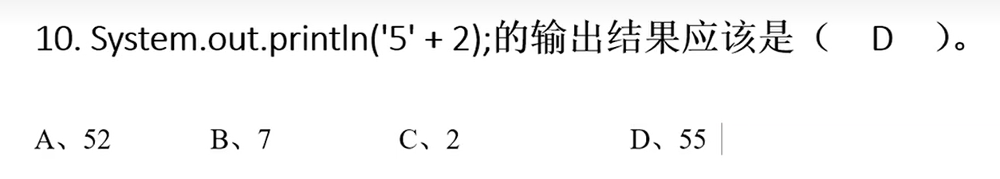

# Java笔试面试集合

*前言: 前几天一家公司要先笔试后面试, 笔试都没过, 太坑了, 好多都是一眼看过去非常熟悉但是就是不确定哪些是100%正确的, 所以刷题是非常有必要的*

> 作者: LaoPeng
>
> 2024/8/6 16:37 始

### 1.哪些是合法的变量名
<span style="color: red">硬要说的话G也可以编译通过, 因为甚至连中文汉字都能作为变量名何况中文的$符号￥</span>为什么在我的印象中是不能使用数字和下划线开头啊(实际下划线是可以的)<br/>


### 2.类名和java文件名是什么关系
```
1. Java的源文件扩展名为.java
2. 如果一个类中的类名字前面没有public 的情况下，类名和文件名没有任何约束
3. 一个java文件中可以有多个类
4. 如果一个类前面有public来修饰，那么这个类必须和文件名字一致
5. 一个类中只能有一个public类，其余的类都不能有public
```


### 3.基本数据类型表述大小
<span style="color: red">下表中从 byte => double 表述范围大小依次递增  为什么long8个字节没有float4个字节表示范围大？是因为底层的存储方式决定的,float的科学计数法</span><br/>
```
byte，short，int，long，float，double，boolean，char
1   ，2    ，4  ，8   ，4    ，8     ，1      ，2   
```


### 4.循环结构合法的是
<span style="color: red">A错 while()条件中可以赋值, 但不能定义变量, 且结果需要是可以boolean值</span><br/>
<span style="color: red">B错 while()条件的结果需要是一个boolean值, int不行</span><br/>
<span style="color: red">D错 请看下段代码 loop标记为需要定义, 选项中并没有定义. break和continue的作用分别为跳出当前循环和跳出当前本次循环, loop可以使其跳出指定(外层)的循环</span><br/>
```java
public class Test {
    public static void main(String[] args) {

        loop:
        while(true) {
            while(true) {
                break loop;
            }
        }

        System.out.println("aa");
    }
}
```


### 5.三目运算符
<span style="color: red">表面上选B, 但实际上选C, 数值类型变量在做运算的时候，会自动把低精度的数值往高精度的数值类型转换。小数默认为double类型。</span><br/>


### 6.局部变量初始化
<span style="color: red">表面上选B, 实际上选D</span><br/>
<span style="color: red">局部变量不会有默认值, 一定要先进行初始化后再使用</span><br/>
<span style="color: red">全局变量(类变量) 会在类初始化时, 由JVM自动赋值默认值</span><br/>
```java
public class Test {
    int cc;
    public static void main(String[] args) {
        Test test = new Test();
        System.out.println(test.cc);
        System.out.println(test.cc++);
        System.out.println(test.cc);
        
        int c;
        System.out.println(c);// idae提示报错: Variable 'c' might not have been initialized, 编译报错 java: 可能尚未初始化变量c
        System.out.println(c++);
        System.out.println(c);

        int x;
        boolean flag = true;
        if (flag) {
            x = 10; // 在分支中初始化
        }
        System.out.println(x);// 此处x一样会编译报错提示初始化x, 除非直接if(true)
    }
}
```


### 7.多变量定义和前加加
<span style="color: red">表面上选D, 实际上就是选D</span><br/>


### 8.主方法main竟然还可以这么写
<span style="color: red">表面上选AD, 实际上就是AD, 主方法的 public static void main是不能变的, 参数字符串数组也不能变, 变量名可以变</span><br/>


### 9.for死循环
<span style="color: red">没有套路, 就是选C</span><br/>


### 10.char+int
<span style="color: red">我以为选B, 但实际选D, 因为字符类型的5+2, 肯定不能选C, '5'的ASCII码不可能是0, 其余的我不知道'5'的ASCII码是多少我也拿不准, 解释是只有字符串的"5"+2才是A, 数值型的5+2才是B, 所以都排除, 只能选D</span><br/>
<span style="color: red">但实际考察的是 字符类型与int类型相加, 是以ASCII码的形式相加的, 并且这样相加打印结果为int型或者说数值型, 如想打印7, 需要强转`System.out.println((char)('5' + 2));`</span><br/>


### 11.表达式
<span style="color: red"></span>BCD, 无套路, 可能需要注意的就是 byte 一个字节是 -128 ~ 127, 所以A是越界的, B是包装类是可以赋值为null的, C是没有越界的16进制可以赋值给long和int都可以,short应该也可以, byte需要强转才可以<br/>


### 12.表达式2
<span style="color: red">表面上看都会出现错误, 但是实际上选A, 从3.基本数据类型可以看到, float是大于long的, 所以小类型是会向大类型自动转换的, D中的10.0要赋值给int需要强转, 因为是大类型向小类型转换, 会丢失精度</span><br/>


### 13.switch与类型转换
<span style="color: red">进过前面几题我知道了选B, 因为返回值result是long类型的, long类型比方法要求的返回值int范围大, 大类型向小类型转换是会丢失精度的, 所以不会自动转换, 需要强转</span><br/>
<span style="color: red">之前我可能会选D, 因为如果不是强转, 正常switch没有break的情况下, 正常执行结果就是10, 由于运算符的优先级 result + i * 2是会先执行 i*2 之后在 result + 这点需要注意(Java运算符优先级)</span><br/>


### 14.后加加前减减
<span style="color: red">选B没毛病, ++, --的运算符优先级是很高的, i++ * 2 == 2 同时1=2, 3 * --i = 3 同时 i=1, 2+3=5, 我觉得比较可能失误的就是i++它是什么时候生效, 当i++参与某一次运算后i就+1了, 比如 i++ * 2 执行完后i就+1了, 所以后面的 --i时, 就已经是--2了 </span><br/>

