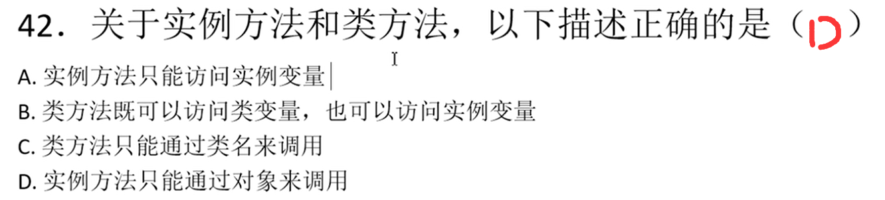

# Java笔试面试集合

*前言: 前几天一家公司要先笔试后面试, 笔试都没过, 太坑了, 好多都是一眼看过去非常熟悉但是就是不确定哪些是100%正确的, 所以刷题是非常有必要的*

> 作者: LaoPeng
>
> 2024/8/6 16:37 始

### 1.哪些是合法的变量名
<span style="color: red">硬要说的话G也可以编译通过, 因为甚至连中文汉字都能作为变量名何况中文的$符号￥</span>为什么在我的印象中是不能使用数字和下划线开头啊(实际下划线是可以的)<br/>


### 2.类名和java文件名是什么关系
```
1. Java的源文件扩展名为.java
2. 如果一个类中的类名字前面没有public 的情况下，类名和文件名没有任何约束
3. 一个java文件中可以有多个类
4. 如果一个类前面有public来修饰，那么这个类必须和文件名字一致
5. 一个类中只能有一个public类，其余的类都不能有public
```


### 3.基本数据类型表述大小
<span style="color: red">下表中从 byte => double 表述范围大小依次递增  为什么long8个字节没有float4个字节表示范围大？是因为底层的存储方式决定的,float的科学计数法</span><br/>
```
byte，short，int，long，float，double，boolean，char
1   ，2    ，4  ，8   ，4    ，8     ，1      ，2   
```


### 4.循环结构合法的是
<span style="color: red">A错 while()条件中可以赋值, 但不能定义变量, 且结果需要是可以boolean值</span><br/>
<span style="color: red">B错 while()条件的结果需要是一个boolean值, int不行</span><br/>
<span style="color: red">D错 请看下段代码 loop标记为需要定义, 选项中并没有定义. break和continue的作用分别为跳出当前循环和跳出当前本次循环, loop可以使其跳出指定(外层)的循环</span><br/>
```java
public class Test {
    public static void main(String[] args) {

        loop:
        while(true) {
            while(true) {
                break loop;
            }
        }

        System.out.println("aa");
    }
}
```


### 5.三目运算符
<span style="color: red">表面上选B, 但实际上选C, 数值类型变量在做运算的时候，会自动把低精度的数值往高精度的数值类型转换。小数默认为double类型。</span><br/>


### 6.局部变量初始化
<span style="color: red">表面上选B, 实际上选D</span><br/>
<span style="color: red">局部变量不会有默认值, 一定要先进行初始化后再使用</span><br/>
<span style="color: red">全局变量(类变量) 会在类初始化时, 由JVM自动赋值默认值</span><br/>
```java
public class Test {
    int cc;
    public static void main(String[] args) {
        Test test = new Test();
        System.out.println(test.cc);
        System.out.println(test.cc++);
        System.out.println(test.cc);
        
        int c;
        System.out.println(c);// idae提示报错: Variable 'c' might not have been initialized, 编译报错 java: 可能尚未初始化变量c
        System.out.println(c++);
        System.out.println(c);

        int x;
        boolean flag = true;
        if (flag) {
            x = 10; // 在分支中初始化
        }
        System.out.println(x);// 此处x一样会编译报错提示初始化x, 除非直接if(true)
    }
}
```


### 7.多变量定义和前加加
<span style="color: red">表面上选D, 实际上就是选D</span><br/>


### 8.主方法main竟然还可以这么写
<span style="color: red">表面上选AD, 实际上就是AD, 主方法的 public static void main是不能变的, 参数字符串数组也不能变, 变量名可以变</span><br/>


### 9.for死循环
<span style="color: red">没有套路, 就是选C</span><br/>


### 10.char+int
<span style="color: red">我以为选B, 但实际选D, 因为字符类型的5+2, 肯定不能选C, '5'的ASCII码不可能是0, 其余的我不知道'5'的ASCII码是多少我也拿不准, 解释是只有字符串的"5"+2才是A, 数值型的5+2才是B, 所以都排除, 只能选D</span><br/>
<span style="color: red">但实际考察的是 字符类型与int类型相加, 是以ASCII码的形式相加的, 并且这样相加打印结果为int型或者说数值型, 如想打印7, 需要强转`System.out.println((char)('5' + 2));`</span><br/>


### 11.表达式
<span style="color: red"></span>BCD, 无套路, 可能需要注意的就是 byte 一个字节是 -128 ~ 127, 所以A是越界的, B是包装类是可以赋值为null的, C是没有越界的16进制可以赋值给long和int都可以,short应该也可以, byte需要强转才可以<br/>


### 12.表达式2
<span style="color: red">表面上看都会出现错误, 但是实际上选A, 从3.基本数据类型可以看到, float是大于long的, 所以小类型是会向大类型自动转换的, D中的10.0要赋值给int需要强转, 因为是大类型向小类型转换, 会丢失精度</span><br/>


### 13.switch与类型转换
<span style="color: red">进过前面几题我知道了选B, 因为返回值result是long类型的, long类型比方法要求的返回值int范围大, 大类型向小类型转换是会丢失精度的, 所以不会自动转换, 需要强转</span><br/>
<span style="color: red">之前我可能会选D, 因为如果不是强转, 正常switch没有break的情况下, 正常执行结果就是10, 由于运算符的优先级 result + i * 2是会先执行 i*2 之后在 result + 这点需要注意(Java运算符优先级)</span><br/>


### 14.后加加前减减
<span style="color: red">选B没毛病, ++, --的运算符优先级是很高的, i++ * 2 == 2 同时1=2, 3 * --i = 3 同时 i=1, 2+3=5, 我觉得比较可能失误的就是i++它是什么时候生效, 当i++参与某一次运算后i就+1了, 比如 i++ * 2 执行完后i就+1了, 所以后面的 --i时, 就已经是--2了 </span><br/>


### 15.赋值与加加减减
<span style="color: red">表面上看, 是num先赋值给num然后再++所以是后++的值覆盖了之前赋值的值, 循环100次就是100, 但是实际上由于JVM的复杂关系, num++在此时并不会生效, **所以记住 i = i++是无效的**</span><br/>
```java
public class Test {
    public static void main(String[] args) {
        int num = 100;
        num = num++ + 1;// 可以看到 num++并没有生效
        System.out.println(num);// 101
    }
}
```


### 16.短路与短路或
<span style="color: red"></span>表面上选D, 实际就是选D, && 和 || 都是短路的, 即&& 前面的条件已经认定为假了, 那么后面的条件根本不会执行, || 也一样, || 前面的条件已经为真了, 那么后面的条件就不会执行, 因为一直满足条件了<br/>


### 17.值传递
<span style="color: red">值传递, 一眼B</span><br/>
<span style="color: red">基本数据类型是值传递, 引用类型(对象)是引用传递(址传递)</span><br/>
```java
public class Test {
    public static void main(String[] args) {
        ArrayList<String> list = new ArrayList<>();
        list.add("A");
        list.add("B");
        list.add("C");
        method(list);

        System.out.println(list);// [A, B, C, D, E, F]

        int i = 10;
        method2(i);
        System.out.println(i);// 10
    }

    public static void method(List<String> list) {
        // 此处add DEF, 很显然是会对外面的list生效的, 因为此处的list就是外部的list(引用传递)
        list.add("D");
        list.add("E");
        list.add("F");

        // 此出给list赋值为 1,2,3的集合, 是不会生效的, 因为 之前参数中的list是指向外部的list,
        // 而此时你将一个新的局部变量集合123赋值给了参数list, 那么这个list就指向了该123, 那么你修改123和我外部的ABC有什么关系?
        list = new ArrayList<String>(Arrays.asList("1", "2", "3"));
    }

    public static void method2(int i) {
        i = i + 10;
    }
}
```


### 18.基本数据类型
<span style="color: red">一眼B, int类型的5与魔除int类型的2, == 1, int类型的5除int类型的2约等于int类型的2</span><br/>
<span style="color: red">假如 a 是float类型, 那么之前讲的不同类型在进行运算时小类型会向大类型自动转换, 5.0 % 2 结果实际上是 1.0f, 1.0f == 1 是为true的, 5.0f / 2 结果也是浮点数 2.5f</span><br/>


### 19.局部变量作用域
<span style="color: red">一眼A, for里面定义的i只能在for里面使用</span><br/>


### 20.短路运算符
<span style="color: red">一眼BD</span><br/>


### 21.表达式编译报错
<span style="color: red">一眼ABCD, A没毛病, B涉及到浮点数(大类型)向int(小类型)赋值, 会丢失精度, 需要强转, C float(小类型)向double(大类型)赋值, 会自动转换, D 字符型被赋值为整数, 这个也是可以的相当于赋值的是ASCII码</span><br/>


### 22.判断中赋值
<span style="color: red">一眼C</span><br/>


### 23.基本数据类型自动转换
<span style="color: red">一眼AD, 之前说过了低类型会向高类型自动转换, 高类型赋值给低类型需要强转, A需要一个float返回值, 直接return;是不行的, D需要float却返回double是需要强转的</span><br/>


### 24.构造方法没有返回值也不需要void
<span style="color: red">表面上选AD, 但实际选CD</span><br/>
<span style="color: red">A 我认为方法是个空实现即{}就是没有方法体的, 但是实际方法出现{}就已经是有实现了, 接口或抽象类中的方法根本没有{}</span><br/>
<span style="color: red">B 参数传递确实是值传递, 引用(址)传递相当于也是值传递, 变量存储的是引用地址, 将引用地址赋值给了方法参数, 也是一种值传递</span><br/>
<span style="color: red">C 构造方法就没有返回值, 也没有声明返回为 void</span><br/>
<span style="color: red">D 方法定义没有返回值即 void, 可以出现return; 来提前结束该方法</span><br/>


### 25.按位与
<span style="color: red">一眼C</span><br/>


### 26.数组下标越界
<span style="color: red">一眼B, 下标越界</span><br/>


### 27.数组定义方式
<span style="color: red">一眼D, 不能在指定数组长度时, 同时指定数组内容</span><br/>


### 28.方法重载
<span style="color: red">一眼D, 重载条件: 参数类型不同, 参数数量不同, 参数顺序不同. (返回值类型不同不可以, 参数名称不同不可以, 与方法修饰符无关)</span><br/>
<span style="color: red">C也是错的, 虽然方法返回类型与不构成重载的条件, 但是当方法已经构成重载即方法参数不一致或类型不一致或顺序不一致时, 方法返回值是可以修改的</span><br/>


### 29.方法重载
<span style="color: red">一眼AC, A方法参数类型不同, C方法参数数量不同, 均构成重载</span><br/>
<span style="color: red">B只有返回值不同, 返回值与构不构成重载无关, D方法参数名不一致不构成重载</span><br/>


### 30.构造方法
<span style="color: red">AB, A构造方法确实不能继承, 如果可以继承则可以随意调用了, 但实际只能在子类构造中通过super()调用且只能在第一行, B都不能被继承还怎么重写</span><br/>
<span style="color: red">C构造方法是可以被重载的, D构造方法可以声明为private, 单例就是</span><br/>


### 31.类的说法
<span style="color: red">一眼D</span><br/>


### 32.自动导入包
<span style="color: red">一眼B, A需要导入参考: java.util.Random, java.util.List使用前需要 import, B自动导入参考: java.lang.String使用前并没有import, C没见过的包, D io包就是要导入参考输入输出流</span><br/>


### 33.构造方法
<span style="color: red">一眼BC, 修饰符的可以变的. AD不对构造方法哪有返回值</span><br/>


### 34.抽象类
<span style="color: red">一眼B</span><br/>


### 35.接口
<span style="color: red">A还可以有default默认实现的方法, 和static静态方法</span><br/>
<span style="color: red">B接口默认就是public的, 也不能用private等修饰符修饰, 貌似jdk1.9之后可以用private修饰了</span><br/>
<span style="color: red">D接口中可以定义常量, 常量和类的属性是不一样的</span><br/>


### 36.修饰符修饰类
<span style="color: red">D和E只能在内部类上修饰</span><br/>


### 37.实现两个接口
<span style="color: red">一眼C</span><br/>


### 38.继承.png
<span style="color: red">表面上选AD, 实际上选CD, A错, 类只允许单一继承, 接口是可以多继承的</span><br/>


### 39.this
<span style="color: red">一眼C, 和构造方法,getter,setter方法中的this一样的</span><br/>


### 40.super
<span style="color: red">一眼C, super是调用父类构造器的，而且必须要出现在子类构造器的第一行。super省略会默认调用父类的默认构造器。如果父类中的构造器存在重载，在子类中需要显式的调用有参构造器或在父类中显式的声明无参构造器。</span><br/>


### 41.构造方法
<span style="color: red">一眼D, 构造方法可以重载, 不存在说只能定义多少个</span><br/>


### 42.实例方法类方法
<span style="color: red">A错, 实例方法中可以访问实例变量也可以访问类(静态)变量</span><br/>
<span style="color: red">B错, 类方法只能访问类变量, 无法访问实例变量</span><br/>
<span style="color: red">C错, 类方法虽然正常是通过类名来调用, 但是非要用实例对象来调用也不会报错</span><br/>
<span style="color: red">D是对的</span><br/>
<span style="color: red">类方法也就是静态变量静态方法, 是在类初始化时候就加载了的, 所以是先于实例对象的, 那么类方法显然是不可以访问实例对象或实例方法的(毕竟有类方法时都没有实例对象), 反之实例方法是可以调用类方法或类变量的(因为有实例对象时, 类方法已经产生了)</span><br/>


### 43.接口的定义与实现
<span style="color: red">一眼D, A错之前说了, 接口中的static方法和default都是有实现的, B接口中只能定义常量, 如果定义 int i = 10; 实际上jvm是会自动加上 public static final， C错, 多个实现类可以有不同的实现方式, 没有必要使用相同的代码</span><br/>


### 44.抽象类
<span style="color: red">C, A错, 子抽象类可以不必将父抽象类的抽象方法全部实现, B错接口是接口, 抽象类是抽象类, 抽象类除了有抽象方法外和普通的类没有太大区别, D错抽象类中也可以有正常的方法</span><br/>
<span style="color: red">C我之前认为直接 new 抽象类然后实现抽象类内部的抽象类的方法也算是一种用抽象类创建对象的方式, 但其实不算, 这种是匿名内部类的方式, 相当于有一个匿名的类继承该抽象类并实现抽象方法, 所以不算抽象类创建的对象而是这个匿名的类</span><br/>


### 45.final关键字
<span style="color: red">C, final成员变量必须初始化(直接初始化和在构造器中初始化)，初始化后不能再更改，因此，如果声明之后没有赋值，仅可在构造器中对其初始化。</span><br/>
<span style="color: red">final可以修饰类和属性和方法，都表示不可再修改。final类不可继承，属性不可更改值，方法不可重写。</span><br/>


### 46.接口抽象类.png
<span style="color: red">AD, A抽象类中是可以什么都没有的, D之前说过接口中可以有static方法和default方法(1.8及以后)</span><br/>


### 
<span style="color: red"></span><br/>


### 
<span style="color: red"></span><br/>


### 
<span style="color: red"></span><br/>


### 
<span style="color: red"></span><br/>


### 
<span style="color: red"></span><br/>


