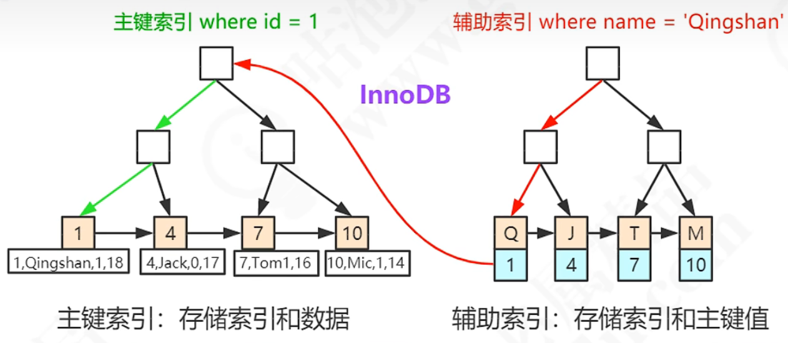
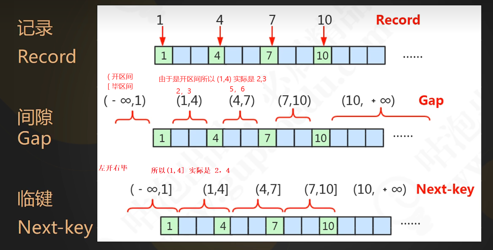
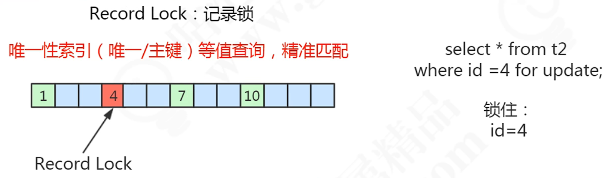
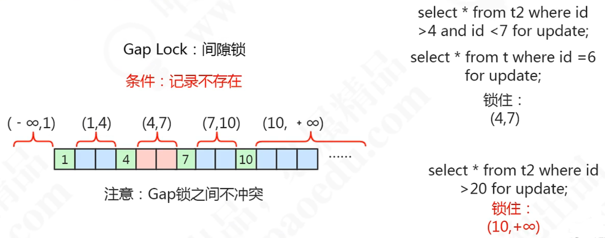
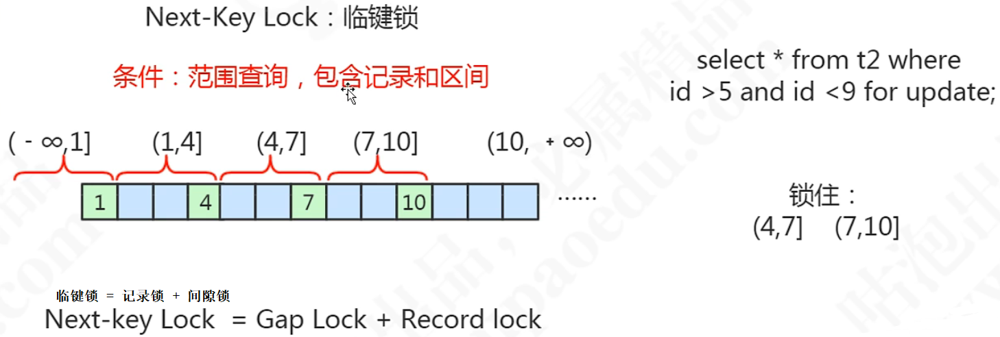

# MySQL事务理解

> 作者: LaoPeng
>
> 2022/7/26 15:31 始


## Transaction Control Language 事务控制语言

事务: 一个或一组sql语句组成一个执行单元，这个执行单元要么全部执行，要么全部不执行。

案例说明：转账  
张三丰 1000  
郭襄   1000

张三丰给郭襄转500元的sql如下:

`update 表 set 张三丰的余额 = 500 where name = '张三丰';`  
意外 如果此时发生意外 就表示 张三丰的余额减了500元 但是 郭襄的余额并没有加500元此时数据就出现了问题.  
那么就需要使用事务使其这俩条update要么都执行成功要么都不执行.  
`update 表 set 郭襄的余额 = 1500 where name = '郭襄';`

**事务的创建:**  
**隐式事务**: 事务没有明显的开启和结束的标记  
比如: insert、update、delete语句  
比如: delete from 表 where id = 1; 这执行之后就是一条事务 会自动提交  
但是有时候 需要 比如两条sql一起组成一条事务。这时候就需要显式事务了。  

**显式事务**: 事务具有明显的开启和结束的标记  
前提: 必须先设置自动提交功能为禁用 如下:  
set autocommit=0; #不是永久关闭自动提交功能 而是关闭了本次会话的自动提交功能

开启事务的语句;  
update 表 set 张三丰的余额 = 500 where name = '张三丰';  
update 表 set 郭襄的余额 = 1500 where name = '郭襄';  
关闭事务的语句;

**使用事务:**
```sql
步骤1: 开启事务
set autocommit=0;
start transaction; 可选的
步骤2: 编写事务中的sql语句(select insert update delete)
语句1;
语句2;
...
步骤3: 结束事务;
commit;提交事务
rollback;回滚事务

savepoint 节点名; 设置保存点
```

`SHOW ENGINES;#查看mysql中有哪些存储引擎`  
`SHOW VARIABLES LIKE 'autocommit';#查看mysql中的autocommit的值 发现为 ON 表示mysql默认开启自动提交(autocommit)`

**查看当前的隔离级别:**
SELECT @@tx_isolation;

**设置当前mysql连接(会话)的隔离级别:**
SET SESSION TRANSACTION ISOLATION LEVEL 隔离级别的名称如READ COMMITTED

**设置数据库系统的全局的隔离级别**
SET GLOBAL TRANSACTION ISOLATION LEVEL 隔离级别的名称如READ COMMITTED

## Mysql存储引擎(表类型)
哪些存储引擎支持事务?  
答: InnoDB, NDB, ...;

我们对不同的表有不同的要求, 比如有的表希望是稳定存储的把他放到磁盘里 那么使用 disk, 有的表希望速度快用完了就不需要的把它放到内存里 那么使用 mem,
有的表希望可以在不同的数据库 或者不同的存储引擎之间去迁移, 那么使用 csv

当在对数据的存储和使用有不一样的需求, 在不同的业务场景下, 可以选择特定的存储引擎.

## 事务的四大特性: ACID
* Atomicity(原子性): 一个事务不可在分割，要么都执行要么都不执行
* Consistency(一致性): 一个事务执行会使数据从一个一致性状态切换到另一个一致性状态
* Isolation(隔离性): 一个事务的执行不受其他事务的干扰
* Durability(持久性): 一个事务一旦被提交，则会永久的改变数据库的数据.

## 三大并发问题:
```text
#脏读: 对于两个事务T1与T2, T1读取了已经被T2更新但还没有提交的数据,
#此时T2回滚了, 那么T1读取到的数据就是临时且无效的

#不可重复读: 对于两个事务T1与T2, T1读取了一个字段,然后T2更新了该字段之后,
#T1再次读取同一个字段,获取到的数据就和之前不一样了.

#幻读: 对于两个事务T1与T2, T1从一个表中读取了一个字段, 然后T2在该表中插入了一些新的行,
#之后如果T1再次读取同一个行,就会多出几行.
```
事务并发的三大问题其实都是数据库**读一致性**问题, 必须由数据库提供一定的事务隔离机制来解决.

## mysql有四种隔离级别:
```text
#1. READ UNCOMMITTED(读未提交数据): 允许事务读取未被其他事务提交的变更。
#脏读,不可重复读和幻读的问题都会出现.

#2. READ COMMITTED(读以提交数据): 只允许事务读取已经被其他事务提交的变更。
#可以避免脏读,但不可重复读和幻读的问题仍然可能出现.

#3. REPEATABLE READ(可重复读)(mysql默认隔离级别): 确保事务可以多次从一个字段中读取相同的值
#在这个事务持续期间,禁止其他事务对这个字段进行更新, 可以避免脏读和不可重复读, 但幻读的问题仍然存在(InnoDB该隔离级别解决了幻读).

#4. SERIALIZABLE(串行化): 确保事务可以从一个表中读取相同的行. 在这个事务持续期间,禁止其他事务对该表
#执行插入,更新和删除操作 所有并发问题都可以避免, 但性能十分低下.
```

## 实现事务隔离级别的两大方案(事务底层原理):
* 第一种: 在读取数据前, 对其加锁, 阻止其他事务对数据进行修改 --- Lock Based Concurrency Control (LBCC)
* 第二种: 生成一个数据请求时间点的一致性数据快照(Snapshot), 并用这个快照来提供一定级别(语句级或事务级)的一致性读取 --- Multi Version Concurrency Control (MVCC)
* 今天主要讲 第一种, 即基于锁的实现

## 表锁与行锁的区别:
* 锁定粒度: 表锁 > 行锁
* 加锁效率: 表锁 > 行锁
* 冲突概率: 表锁 > 行锁
* 并发性能: 表锁 < 行锁
* InnoDB支持表锁与行锁, MyISAM只支持表锁

InnoDB锁的类型:

锁的模式 Lock Mode
* 共享锁(行锁): Shared Locks
* 排他锁(行锁): Exclusive Locks
* 意向共享锁(表锁): Intention Shared Locks
* 意向排他锁(表锁): Intention Exclusive Locks

行锁算法
* 记录锁 Record Locks
* 间隙锁 Gap Locks
* 临键锁 Next-key Locks

**共享锁(S锁): 又称为读锁**, 顾名思义, 共享锁就是多个事务对于同一数据可以共享一把锁, 都能访问数据, 但是**只能读不能修改**  
加锁方式: select * from student where id = 1 LOCK IN SHARE MODE;  
释放锁: commit/rollback;
```sql
# 会话1 开始事务并查询 id = 1 这一行的数据, 同时加上 读锁(共享锁)
begin;
SELECT * FROM `student` where id = 1 lock in share mode;


# 会话2 仍然可以读取到 id = 1 这一行的数据, 因为共享锁就是多个事务对于同一数据可以共享一把锁, 都能访问数据
begin
SELECT * FROM `student` where id = 1 lock in share mode;

# 会话2, 当会话1给id = 1 这一行数据加上读锁, 此时会话2对id = 1这一行数据进行delete操作, 会一直进入等待, 因为id = 1这行数据被加读锁了
# 除非 会话1 结束事务(rollback或commit), 结束事务表示释放锁, 则会话2结束等待,并执行delete操作, 但是并未删除, 需等到会话2commit后, 删除成功. rollback则回滚(不删除)
begin
delete from student where id = 1;
commit;
```

**排他锁(X锁): 又称为写锁**, 排他锁不能与其他锁并存, 如一个事务获取了一个数据行的排他锁, 其他事务就不能再获取该行的锁(共享锁, 排他锁),
只有该获取了排他锁的事务是可以对数据行进行读取和修改.  
加锁释放方式:  
自动: delete / update / insert 默认加上X锁  
手动: select * from student where id = 1 for update;
```sql
#会话1 开始事务并修改 id = 1 这一行的数据, 同时加上 写锁(排他锁) (默认加上的 delete / update / insert 默认加上X锁)
begin;
update student set sname = '张三Plus' where id = 1;

#会话2, 当会话1给id = 1 这一行数据加上写锁, 则 增删改 都会进入等待, 等待会话1释放锁(rollback或commit), 然后才会执行
begin;
select * FROM `student` where id = 1 lock in share mode;#尝试获取读锁, 进入等待...
select * from student where id = 1 for update;#尝试获取写锁, 进入等待...
delete from student where id = 1;#删除数据, 进入等待... (delete默认加写锁)

#会话2, 当会话1给id = 1 这一行数据加上写锁时
#该语句居然不会等待, 而是直接查出数据, 我觉得很疑惑???
#从排他锁的角度来讲, 排他锁是不能与其他锁并存, 则另一个事务(此处指会话2), 对这行数据进行 增删改都是需要等待的(因为增删改默认加排他锁), 需要等待会话1释放锁了之后才会执行,
#使用select查询这行数据并未加锁, 与排他锁的定义: 排他锁是不能与其他锁并存,相符合, 所以查询到老数据(update之前的数据)很正常.
#从事务的角度讲, 当事务1加了写锁后(update了但还未提交), 事务2居然可以查询该行数据(查询的是update之前的数据), 虽然就算事务rollback了,事务2查询的还是老数据
#即保证了事务的一致性(不会出现不可重复读的现象),  但是还是好疑惑, 也不知道疑惑的什么 哈哈哈 (可能这就是增删改默认加排他锁,而查询不用加锁的原因,反正查出的是老数据,只有真正commit后,才会查出新数据)
select * from student where id = 1;
```

**意向锁**是由数据引擎自己维护的, 用户无法手动操作意向锁.  
**意向共享锁(Intention Shared Lock), 简称IS锁**表示事务准备给数据行加入共享锁, 也就是说一个数据行加共享锁前必须取得该表的IS锁.
**意向排他锁(Intention Exclusive Lock), 简称IX锁**表示事务准备给数据行加入排他锁, 说明事务在一个数据行加排他锁前必须先取得该表的IX锁.

**为什么需要(表级别的)意向锁??**
一个事务成功的给一张表加上表锁的前提是, 没有其他任何事务已经锁定了这张表的任何一行数据.  
所以需要进行全表的扫描看看有没有一行数据已经被加锁了, 这样效率就十分低下, 而且万一当扫描到后面的行时, 有事务给前面的行加了锁, 最后加表锁时还是会失败.  
所以, 需要有意向锁, 作用: 提高加表锁的效率. 直接看该表是否有意向锁, 如果有很显然加表锁是不成功的.

## 锁到底锁住了什么??
锁的本质是为了解决资源竞争的问题, 即你要用这个资源,我也要用这个资源的时候, 让大家相互的排斥

锁到底锁住了什么?  一行数据(Row / Record)吗?  一个字段(Column)吗?  

**假设锁是锁住了一行数据. where id = 1 for update; 即锁定 id = 1这一行数据**
```sql
/**
 * #######################################      t1表, 没有主键,没有索引     ##########################################
 * CREATE TABLE t1  (`id` int(11) DEFAULT NULL, `name` varchar(255) DEFAULT NULL) engine=INNODB DEFAULT CHARSET=utf8
 */
#会话1, 对 id = 1 这行开启排他锁
begin;
select * from t1 where id = 1 for update;
    
#会话2, 
begin;
select * from t1 where id = 1 for update;#对 id = 1 这行开启排他锁查询, 显然会话1已经对id = 1 这行加锁了, 则该语句肯定要等待会话1释放锁之后才会执行.

begin;
select * from t1 where id = 3 for update;#对 id = 3 这行开启排他锁查询, 居然也在等待, 明明会话1锁的是id = 1 这行, 为什么我对id = 3这行进行操作也会等待???

begin;
insert into t1(id,name) values(5, '5'); #插入 id = 5的一行数据(insert默认开启排他锁), 居然也在等待, 明明会话1锁的是id = 1 这行, 为什么插入也在等待???

/**
 * 在表 没有主键, 没有索引 的情况下,
 * 感觉好端端一个行锁, 就好像变成了一个表锁一样
 */
```
\############################################################################################################\
```sql
/**
 * #######################################      t2表, 有主键,没有索引     ##########################################
 * create table t2(`id` int(11) not null,`name` varchar(255) default null,primary key(`id`)) engine=innodb default charset=utf8;
 */
#会话1, 对 id = 1 这行开启排他锁 (id 为 主键)
begin;
select * from t2 where id = 1 for update;

#会话2
begin;
select * from t2 where id = 1 for update;#对 id = 1 这行开启排他锁查询, 显然会话1已经对id = 1 这行加锁了, 则该语句肯定要等待会话1释放锁之后才会执行.

begin;
select * from t2 where id = 4 for update;#对 id = 4 这行开启排他锁查询, 可以查询到了, 那么为什么 id 变为主键后就感觉行锁变为了真正的行锁
 
/**
 * 在表 有主键, 没有索引 的情况下,
 * 为什么 id 变为主键后就感觉行锁变为了真正的行锁
 */
```
<br/>

**假设锁是锁住了一个字段. where name = '4' for update; 即锁定 name = '4' 这一个字段**
```sql
/**
 * #######################################      t3表, 有主键,有索引     ##########################################
 * create table t3(id int(11) not null,name varchar(255) default null,primary key(`id`),unique key `uk_name` (`name`)) engine=innodb default charset=utf8;
 */
#会话1 对 name = '4', 这个字段加锁
begin;
select * from t3 where name = '4' for update;

#会话2
begin;
select * from t3 where name = '4' for update;#很显然会话1加了锁未释放, 会话2加一模一样的锁, 肯定是不能成功的

begin;
select * from t3 where id = 4 for update;#如果说 锁是锁字段的话, 为什么给 id = 4;的加锁也不能成功 (id=4,name='4'是一行数据)

begin;
select * from t3 where name = '2' for update;#如果说 锁是锁字段的话, 那么会话2给name=2的字段加锁并查询, 成功了.

/**
 * 这个例子我都不知道说什么, 只能说 应该是证明了锁是锁一行, 而不是锁一个字段
 */
```
那么这3张表的区别就是
* 不使用索引 t1
* 主键索引  t2
* 唯一索引  t3

根据对上面三个表不同的sql语句是实验, 引出两个问题:

**1. 表没有索引, 为什么会锁表?** (t1表引出的问题)  
聚集索引: 索引的逻辑顺序与数据物理存放的顺序是一致的, 这样的索引 我们叫聚集索引.  
一张表中的聚集索引一定是只有一个. 也就是 只有一个索引能够决定数据的物理存放的顺序  
用新华字典来比喻, 字典中有很多索引, 拼音, 笔画, 偏旁部首, 但是数据实际的存放顺序只跟 拼音这个索引排序的方式是一致的, 所以拼音是聚集索引  
既然聚集索引要决定数据存放的顺序, 所以数据表中必然有一个聚集索引, 所以一张表不可能没有索引  

那么谁是聚集索引???
1. primary key (如果已经定义了主键, 则主键是聚集索引, 也就是主键会决定数据存放的顺序)
2. unique key -- no null (如果没有主键, 但是有一个 没有空值的 唯一索引, 那么会找到第一个唯一索引把它作为聚集索引, 决定数据存放的顺序)
3. _rowid (上面两种情况都没有, 则由_rowid作为聚集索引, 在InnoDB中为每一行实现了3个隐藏字段(_rowid, tx_id, roll_ptr), _rowid就是其中之一)

为什么会锁表呢?  
因为无论通过任何的条件去查询数据, 都只能走全表的扫描, 而全面扫描会把表里面的数据每一行的隐藏的_rowid 都锁定起来, 所以才会造成一个锁表的现象  

**2. 为什么通过name字段(唯一索引)会将同一行的id字段(主键)给锁住呢?**(t3表引出的问题)  
在InnoDB中索引分为两类:
* 聚集索引 (主键)  
* 二级索引  
  
所以说 给name加锁, 最后还是会找到id(name索引的B+树只存name的值与name对应主键的值, 然后根据主键再去主键索引的B+树中找值), 然后给id加锁  
我估计如果name是个普通字段(没有索引), 最后估计也是找到id加锁  
**InnoDB中锁的本质就是 锁的索引项**  
(where的什么如果是索引项则锁的索引项, 如果是普通字段, 则锁的主键, 如果没有主键, 则锁的gen_clust_index表示聚集索引, 即没有主键也没有索引, 显然聚集索引就是_rowid, 则锁的_rowid)
  
## InnoDB是如何解决幻读的
首先明白区间的定义 (实际幻读是通过, 间隙锁来解决的)


**记录锁**

```sql
# 记录锁这里就不多说了, 之前使用的 共享锁,排他锁都属于记录锁, 即where条件精确匹配(即表中有数据1, 4, 7, 10)where id = 4; 即精确匹配,
# 如where id = 6, 则不属于精确匹配, 因为id = 6不存在, 所以不属于记录锁

# 会话1 对t2表中的 id = 2 这一行进行加锁, 精确匹配, 记录锁(虽然此处加的排他锁)
begin;
select * from t2 where id = 2 for update;#只锁住 id = 2 这一行 (前提是 id = 2在数据库中存在)

# 会话2
select * from t2 where id = 3 for update;#可以对 id = 3的这一行正常枷锁, 正常查询
insert into t2 values(5, '5')#可以插入 id = 5的数据
```


**间隙锁**

```sql
/**
 * #######################################      t4表, 有主键id, 数据有 1, 4, 7, 10 四条数据     ##########################################
 * create table t4(id int(11) not null,name varchar(255) default null,primary key(id)) engine=innoDB default charset=utf8;
 */
# 会话1, 对 id = 6的这行加锁, 但是表中并没有 id = 6的这行数据, 表中数据1,4,7,10 那么6是属于 (4,7)由于是开区间所以实际是(5,6)
# 即, where id = 6;实际是锁住了id = 5, 6的两行
begin;
select * from t4 where id = 6 for update;

# 会话2
insert into t4 values(5, '5') #不成功, 被间隙锁锁了(4,7)实际是5,6
insert into t4 values(6, '6') #不成功, 被间隙锁锁了(4,7)实际是5,6
insert into t4 values(8, '8') #成功, 间隙锁锁的是(4,7)并没有锁住 8
select * from t4 where id = 6 for update; #成功, 间隙锁之间不冲突, 虽然是间隙锁锁锁住了5,6两行,
# 但是5,6两行实际是没有数据的,要不然也不会是间隙锁, 所以由于没有数据, 冲突也是没有意义的, 反正查出来也没有数据

#################################################################################################

# 会话1, 看这个锁的范围表面上是 (20, 正无穷), 实际是表中数据为 1,4,7,10 最大都是10, 所以按表中的间隙为 (10, 正无穷)  (注意开区间,所以10其实是11)
# 即, where id > 20; 实际是锁住了 11,正无穷
select * from t4 where id > 20 for update;

# 会话2, 插入11, 11属于 11,正无穷 那么肯定是会被阻塞的, 有人如果认为 会话1是 id > 20 就以为锁住的是 (20, 正无穷) 那么这里就会以为11不会被阻塞了,就错了
insert into t4 values(11, '11')
select * from t4 where id = 11 for update;#不会被阻塞的,id=11没有数据,所以冲突没有意义

/**
 * 有一点点意思了, 间隙锁主要就是阻塞了 插入
 */
```


**临键锁**

```sql
/**
 * #######################################      t4表, 有主键id, 数据有 1, 4, 7, 10 四条数据     ##########################################
 * create table t4(id int(11) not null,name varchar(255) default null,primary key(id)) engine=innoDB default charset=utf8;
 */
 
# 会话1 , 对 id > 1 and id <= 10的中间的行全部加锁, 实际就是 2,10 加锁, 包括2的区间, 与10的区间, 与2,10中间所有的区间
begin;
select * from t4 where id > 1 and id <= 10 for update;

# 会话2,
begin;
select * from t4 where id = 4 for update; #需要等待???之间不是说间隙锁不冲突吗? 不冲突是因为空数据, 这是临键锁区间包含 数据与空行, 此处 id = 4;有数据所以需要等待
select * from t4 where id = 5 for update; #不需要等待, 因为 id = 5为空值, 不会冲突

insert into t4 values(6, '6') #需要等待, 因为在区间 2,10之间
insert into t4 values(8, '8') #需要等待, 因为在区间 2,10之间

insert into t4 values(15, '15'); #需要等待, 虽然区间在2,10之间, 但是还包括2所在区间与10所在区间, 由于10后面没有数据了所以,10所在区间为 [10, 正无穷)
insert into t4 values(-1, '-1'); #不需要等待, -1不在区间内, 2的区间在 (1, 4]
```

那么具体是如何解决幻读的? 大家想一想刚刚讲的这三种锁: 记录锁, 间隙锁, 临键锁

记录锁 精致匹配 where id = 1; (id = 1这行数据存在), 只会给 id = 1;这行上锁,  
其他行该怎么插入就怎么插入, 不会影响 id = 1这一行, 多次查询也只能查出来同样的数据, 这样就保证了不会出现幻读.

间隙锁 where id = 6; (id = 6这行数据不存在), 则会给 6 所在的间隙加锁, 比如间隙为(4,7), 则只会给 4,7之间加锁  
其他行该怎么插入就怎么插入, 不会影响 id = 6这一行, 多次查询也只能查出来同样的数据, 这样就保证了不会出现幻读.

临键锁 where id > 1 and id < 11的中间的行全部加锁, 实际就是 2,10 加锁, 包括2的区间, 与10的区间, 与2,10中间所有的区间,  
其他行该怎么插入就怎么插入, 不会影响 id > 1 and id < 11中间这些行, 多次查询也只能查出来同样的数据, 这样就保证了不会出现幻读.

## InnoDB事务隔离级别的实现
READ UNCOMMITTED(读未提交数据): 允许事务读取未被其他事务提交的变更。  
实现: 不加锁

READ COMMITTED(读以提交数据): 只允许事务读取已经被其他事务提交的变更。
普通的select实现: MVCC
加锁的select和更新: Record Lock 即记录锁, 与 重复键的检查与外键约束检查也会用到 间隙锁 (绝大部分情况不用间隙锁, 所有解决不了幻读)

REPEATABLE READ(可重复读)(mysql默认隔离级别): 确保事务可以多次从一个字段中读取相同的值,在这个事务持续期间,禁止其他事务对这个字段进行更新  
普通的select实现: MVCC
加锁的select和更新: Record Lock, Gap Lock, Next-key Lock, 即记录锁,间隙锁,临键锁

SERIALIZABLE(串行化): 确保事务可以从一个表中读取相同的行. 在这个事务持续期间,禁止其他事务对该表  
实现: 所有的select语句都会被隐式的转为 select ... lock in share mode, 会和insert, update, delete互斥
