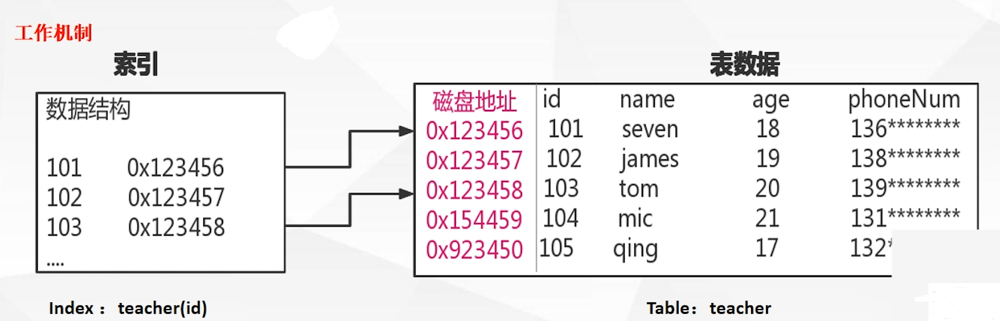

# MySQL索引理解

> 作者: LaoPeng
>
> 2022/7/28 16:58 始

带着问题来理解mysql B+Tree索引机制
* 理解清楚索引定义和工作原理
* MySQL为什么选择B+Tree?
* Mysql中B+Tree索引如何落地的
* 理解Mysql索引的几个原则

正确的创建合适的索引是提升数据库查询性能的基础

索引是什么?  
索引是为了加速对表中数据行的检索而创建的一种分散存储的数据结构  
  
我的理解为：索引就是根据字段建立B+Tree结构, B+Tree每一个节点核心属性为key,value; key=字段值, value=引用地址  
比如: key=id值, value=该行数据的磁盘地址 (聚集索引), key=name值, value=该name所对于id (二级索引)  
然后查询就是查询B+Tree, 效率极大提升.

为什么不使用二叉搜索树?  
极端情况二查搜索树会退化为链式结构, 查询效率很慢 类似 全表扫描

为什么不使用平衡二叉树?
* 搜索效率不足, 一般来说在树结构中数据处的深度决定着它搜索时IO次数(树是存放在硬盘中的(因为索引所建立的树是很大的一两个G很正常, 所以不能放在内存中), 所以每次left, right都是IO), 
相当于就是说 二叉树数据多了之后树的层级必然很多层, 找个数据进行四五十次IO, 那么效率相当的低了. (也就是说每层存储的数据太少了)
* 节点数据内容太少, 每一个磁盘块(节点/页/4k)保存的关键字数据量太小了, 没有很好的利用操作系统和磁盘的数据交换特性和磁盘预读能力(空间局部性原理)

<br/>

B树是叶子节点和非叶子节点都存储数据, B+树是只有叶子节点的链表中才存储数据(且该链表的最大值会指向隔壁链表的最小值, 以一个个有序的小链表, 形成一个有序的大链表).  
   

**为什么会选用B+Tree?**
* **B+树是B树的变种, 多路绝对平衡查找树, 它拥有B树的优势**
* **B+树扫库、表能力更强** (可以直接遍历底部链表)
* **B+树的磁盘读写能力更强** (非叶子节点不用存储数据, 即可以存储更多的索引值, 如原本只能存储 1,3,5(以及这3个id对应的数据),现在可以存储1,3,5,7,9,11,13 相当于路数变多,  
  比如原本是2-3-4树, 现在变成了2-3-4-..-8树,那么每层存储的节点变多, 相当于树就变矮(层数减少), 就可以减少IO次数,   
  每层只需IO一次(不是说每层的节点只需IO一次就全部读取, 而是说IO一次读取一个节点,然后就可以根据这个节点到下一层), 这样就可以减少IO次数)  
* **B+树排序的能力更强** (数据全部在叶子节点的链表中(链表有序), 而且每个叶子节点的链表尾部还与兄弟叶子节点的链表头部相连, 一个个短小链表, 组成一个完整的链表,  
  且这个链表还是有很多段, 即保证了查询效率, 又是相当于是一个完整的链表保证了排序能力, 同时 B+树扫库、表能力更强)
* **B+树的查询效率更加稳定** (数据存放在叶子节点 即层数一样 假如有3层 那么每次查询遍历3层, 找到数据, 比较稳定)
* https://tech.meituan.com/2014/06/30/mysql-index.html 这篇文章特别好

## B+Tree索引体现形式-MyISAM
存储引擎是myisam, 在data目录下会看到3类文件：.frm、.myi、.myd  
（1）.frm  表定义，是描述表结构的文件。  
（2）.MYD  "D"数据信息文件，是表的数据文件。  
（3）.MYI  "I"索引信息文件，是表数据文件中任何索引的数据树  

myisam中索引是没有主次之分的, 基本上是一个平级的状态(那么意思就是没有 "回表" 这个过程)  
   

## B+Tree索引体现形式-InnoDB
存储引擎是InnoDB, 在data目录下会看到2类文件：.frm、.ibd  
（1）.frm  表结构的文件。  
（2）.ibd  表数据和索引的文件。该表的索引(B+树)的每个非叶子节点存储索引，叶子节点存储索引和索引对应的数据。  

辅助索引为什么要存储id值, 而不直接存储数据指向地址?  

是因为B+树操作一定会产生 分裂,合并 的过程(保持B树的绝对平衡), 那么就一定会产生地址的变化, 地址变化之后还需要维护辅助索引的地址, 就比较浪费效率,  
直接存储id值, 这样就不用维护辅助索引了 (我觉得也不一定是id值, 应该是聚集索引的列, 如果聚集索引的列是_rowid, 那么辅助索引应该存储的是_rowid)  
   

## myisam与innodb
所以说 myisam 查询的话是比 innodb 快一些的, 毕竟myisam不需要回表.(一次b+树遍历)  而 innodb需要回表 (两次b+树遍历)  
myisam不支持事务(表锁)
   

## 索引的几大原则
**列的离散性**

sex的离散性就很不好嘛, 一共就两值 男 女, 想一想 以 sex 做索引, 根据 sex 建立B+树, 每个节点都是 男 女, 基本上每个节点都命中, 那效率自然慢了  
当一个索引离散性很差的时候, 查询优化器会选择不走索引, 直接走全表扫描
   

<br/>

**最左匹配原则**

最左匹配原则不仅作用于 复合索引, 对字符串的单列索引也是符合的 "abc" 也是先找 'a' 在 'a'满足的条件下找到所有 'a'后面是'b'的, 然后在"ab"的基础上找 'c'  
    

<br/>

**联合索引**  
联合索引没什么好说的, 理解了上面的最左匹配原则自然就明白了联合索引
    

<br/>

**覆盖索引**  
如果查询的列, 通过***索引项的信息可直接返回***, 则该索引称之为查询sql的覆盖索引
```sql
# teacher表 PK(id)主键索引, key(name, phoneNum)联合索引, unique(teacherNo)唯一索引
select teacherNo from teacher where teacherNo = ? # 是覆盖索引, 查询项teacherNo在索引项信息中存在
select id,teacherNo from teacher where teacherNo = ? # 是覆盖索引, 查询项id,teacherNo在索引项信息中存在 (非聚合索引, 存储索引字段值与id)
select name, phoneNum from teacher where teacherNo = ? # 不是覆盖索引, 查询项name,phoneNum均不在索引 teacherNo 中存在
select phoneNum from teacher where name = ? # 是覆盖索引, 查询项phoneNum在联合索引中 (根据最左匹配原则 name = ?是会触发索引的)
```


