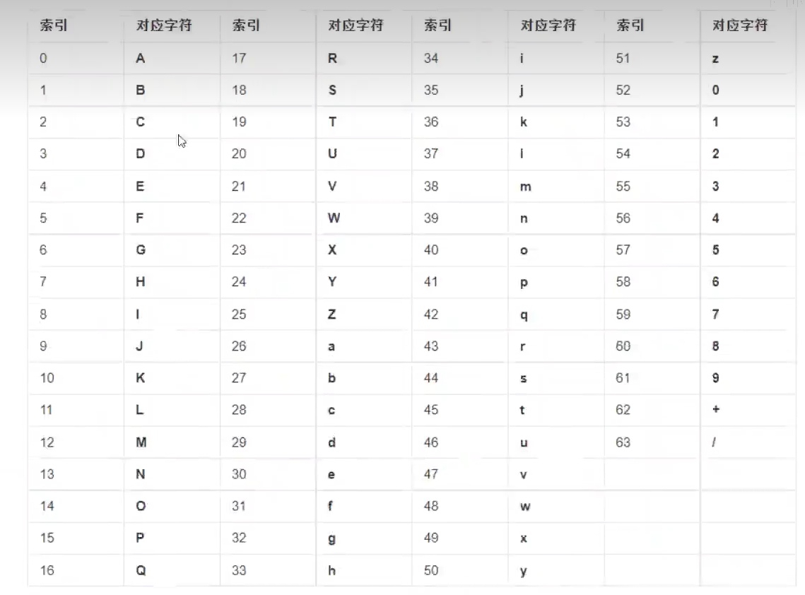

# 密码学

> 作者: LaoPeng
>
> 2022/9/7 16:16 始


## 一、发展历史

### 1.1 古典密码学

如 凯撒密码、滚筒密码

### 1.2 近代密码学

如 德国Enigma机，被图灵破解

### 1.3 现代密码学


## 二、编码算法

> 不是加密和解密，为了在网络间更加方便的传输数据 或 本地存储字节数组 而产生

### 2.1 base 64

由A-Z、a-z、0-9、+、/共64个字符组成，去掉 i I o O + /即base58



注意：base64以三个字节为一组，如果最后一组不足3个字节，则使用=号补充

### 2.2 URL编码

```xml
# 前面的提交到后端的默认编码
application/x-www-from-urlencoded
```


## 三、摘要算法

### 3.1 定义

又叫Hash算法、散列函数、数字摘要、消息摘要。它是一种单向算法，用户可以通过hash算法对目标信息生成一段特定长度的唯一hash值，但不能通过这个hash值重新获得目标信息。（简单来说就是：通过key可以获取hash值，但是不能通过这个hash值反过来获取key）

### 3.2 应用场景

* 密码、信息完整性校验、数字签名

### 3.3 常见算法

* MD5: Message-Digest Algorithm，结果占128位 ==> 16个byte ==> 转为16进制字符串后是32个字符
* SHA(Secure Hash Algorithm)：安全散列算法
  * sha-256 ==> 转为16进制字符串后是64个字符
  * 其他如 sha-0，sha-1，sha-512
* MAC(Message Authentication Code)：消息认证码，是一种带有密钥的hash函数
* 其他如：MD2，MD4，HAVAL


## 四、对称加密

### 4.1 定义

也叫单密钥加密。所谓单密钥，指的是加密和解密的过程使用相同的密钥，相比非对称加密，因只有一把钥匙，因而速度更快，更适合加解密大文件。

### 4.2常见算法

* DES：data encryption standard，已经过时
* AES：advanced encryption standard，代替DES。
* 其他：3DES, Blowfish, IDEA, RC4, RC5, RC6

### 4.3 分类

* 分组加密，又叫块加密
* 序列加密

### 4.4 块加密常用的加密模式

* ECB
  * 定义：electronic code book，电话本模式，将整个明文分成若干段相同的小段，然后对每一小段进行加密
  * 特点：每段之间互不依赖，可以并行处理；同样的明文总是生成同样的密文。

* CBC
  * 定义：cipher block chaining，密文分组链模式，所谓链，即密文分组之间像链条一样相互连接在一起。先将明文切分成若干小段，然后每一小段与上一段的密文段(第一个块因没有上一个密文段，使用的是IV)进行运算后，再与密钥进行加密
  * 特点：串行处理；同样的明文每次生成的密文不一样。

### 4.5 块加密常用的填充模式

为什么要有？对于固定的加密算法，每个块有固定大小(BlockSize)，比如8个byte，明文分块后，加密前需要保证对最后一个块的大小为8个byte，如果不够则使用特定数据进行填充。

* NoPadding：不自动填充

  des时要求原文必须是8个字节的整数倍，aes时是16字节的整数倍

* PKCS5Padding(限制了块大小为8个byte的PKCS7Padding) / PKCS7Padding

## 五、非对称加密

### 5.1 定义

加密和解密使用的是两个不同的密钥(public key 和 private key). 公钥可以给任何人，私钥总是自己保留。

### 5.2 为什么出现?

对称加解密使用相同的密钥，但对不同的原始内容加密会采用不同的密钥，导致密钥数量巨大，难以维护.

### 5.3 常见算法

* RSA
* 其他如：ECC，Diffie-Hellman，El Gamel，DSA

### 5.4 应用场景

* 加解密
* 数字签名
* 数字信封
* 数字证书